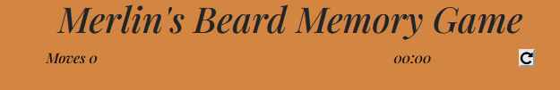

# __Merlin's Beard!__

## Code Institute Milestone Project 2

<a href = "https://lunarwriter.github.io/IFE-MS-2/" rel="nofollow"> View the live project here</a>

This is the website for Merlin's Beard! A fun interactive memory game for those who are fervent Harry Potter enthousiasts and are familiar with the wand movements.
Each time a player starts the game, the timer starts and their moves are counted. The player can restart the game to improve their scores! The memory game board will automatically shuffle cards for the players when a new game starts.

 

<h2 align="center">

</h2>

 

## User Experience (UX)

* ### User Stories

    * __Player Goals__

        1. As a Player, I want to be able to understand immediately what kind of game I will play.
        2. As a Player, I want to know how many moves and how long I played before finishing the game.
        3. As a Player, I want to be able to play the game again.

* ### Design

    * __Colour Scheme__

        * The main colours used are hues of brown, orange and beige.

     

    * __Typography__

        * The main font used for this game is Playfair Display. This font has a distinctive and rustic atmosphere which is very suited for the theme of the game.

 

## Features

__Existing Features__

* __Home Screen__

    * The user is immediately faced with a homescreen consisting of a title, the memory cards and the timer and move counter. The game starts once the player starts clicking on the cards.

 

 __Possible Future Features__

* The game can be improved by adding some more memory cards, making the game a little more difficult for the user by adding more moves and more time for playing.
* A feature for checking if the user really wants to restart the game can be added as well. The timer can be paused temporarily until the user has submitted their answer. The game can either be restarted or continued where the user left off.

 

## Wireframes

* [Home Page](https://github.com/lunarwriter/IFE-MS-2/blob/master/docs/wireframes/home-wireframe.png "homepage wireframe")
* [Mobile Wireframe](https://github.com/lunarwriter/IFE-MS-2/blob/master/docs/wireframes/mobile-wireframe.png "mobile wireframe")

 

##  Technologies Used

### Languages Used

* [HTML5](http://en.wikipedia.org/wiki/html5 "HTML5")
* [CSS3](http://en.wikipedia.org/wiki/css3 "CSS3")
* [JavaScript](https://en.wikipedia.org/wiki/JavaScript "JavaScript")

 

### Frameworks, Libraries and Programs Used
1. [Bootstrap 4.3:](https://getbootstrap.com/docs/4.3/getting-started-introduction/ "Bootstrap4.3")
    * Bootstrap was used to assist with responsiveness and styling of the website.
2. [Google Fonts:](http://fonts.google.com/ "GoogleFonts")
    * Google Fonts were used to import the "Playfair Display" font into the style.css file. The font is used for all text in the game.
3. [Font Awesome:](http://fontawesome.com/ "Fontawesome")
    * Font Awesome was used to implement the repeat button on the top right corner for the game.
4. [jQuery:](http://jquery.com/ "jQuery")
    * jQuery came with Bootstrap to make sure the memory game was responsive to the moves counter and timer.
5. [Git:](http://git-scm.com/ "Git")
    * Git was used for version control by utilizing the Gitpod terminal to commit to Git and Push to GitHub.
6. [GitHub:](http://github.com/ "GitHub")
    * GitHub is used to store the projects code after being pushed from Git.
7. [Mockplus:](https://www.mockplus.com/ "Mockplus")
    * Mockplus was used to create the wireframes for the website.

 

## Testing

The W3C Markup Validator and W3C CSS Validator Services were used to validate every page of the project to ensure there were no syntax errors in the project.

* [W3C Markup Validator](https://validator.w3.org/ "markup-validator") - [Results](https://validator.w3.org/nu/#textarea "markup-validator-results")
* [W3C CSS Validator](https://jigsaw.w3.org/css-validator/#validate_by_input "css-validator") - [Results](https://jigsaw.w3.org/css-validator/validator "css-validator-results")

 

### Devices and Screen Sizes

The website was extensively tested to make sure every aspect became responsive to the screen size of the devices.
The browsers that were used for testing are: Microsoft Edge, Google Chrome and Mozilla Firefox.
To test the website on different devices and different screen sized, the Chrome DevTools was used.

* Laptop with HiDPI screen: 1440x900
* iPad: 768x1024
* iPhone 6/7/8 Plus iOS 11: 414x736

 

__Testing User Stories from User Experience (UX) Section__

* __First Time Visitor Goals__

    1. As a Player, I want to be able to understand immediately what kind of game I will play.

        * When the player opens the link, they will immediately be brought to the home screen which is the game screen. Upon reading the title, they will notice they will play a memory card game.
        * Once the player clicks on one of the cards, the card will flip and show an image. If the player clicks a second card and it matches, the cards will stay flipped with the image shown. If the second card does not match the first card, the second card will flip over and the user can click a different card to keep playing.

     
    
    2. As a Player, I want to know how many moves and how long I played before finishing the game.

        * Underneath the title, the player can see a section with "Moves:.." and a clock which indicate the amount of moves the player has made as well as the time it takes to finish the game.

     

    <h2 align="center">
    
    </h2>
    
    3. As a Player, I want to be able to play the game again.

        * Once the player finishes the game, they will receive a feedback message stating their victory. Once the player clicks on the "OK" button, they will be redirected to the home screen. On the top right corner is a button with a refresh icon. If the player clicks on that button, the game will automatically restart and they can play once more.
    
     

    <h2 align="center">
    
    </h2>
   
 

## Known Bugs

* When a user is playing the game on a smaller screen, the memory cards are a little stretched and the cards are not shown entirely on the screen. The user has to scroll a little to the right. However, the user can still select the cards and see which one they clicked on.

 

## Fixed Bugs

* When opening the link for the game, the background for the body would not load and the user would have a white background. This is fixed now and the user will see a background with brown and yellow hues.
* The timer would not start counting until the player clicked on their second card. This is now fixed and the timer will start when the user clicks on the first card.

 

## Deployment

__Running the website from GitPod__

1.	Log in to GitHub and locate the GitHub [Repository](https://github.com/lunarwriter/IFE-MS-2/ "github pages repository")
2.	On the right of the Repository name, click on the green “GitPod” button.
3.	Log in to GitPod and open the workspace with the same name as the repository.
4.	In the second column from the left, select the file to open the project.
5.	In the terminal (below the console), type: `python3 -m http.server`
6.	A popup will appear for action on port 8000. Click on the blue button for “Make Public”.
7.	Click on the second blue button “Open Browser” to open a preview of the website.

 

__GitHub Pages__

The project was deployed to GitHub Pages using the following steps...

1. Log in to GitHub and locate the GitHub [Repository](https://github.com/lunarwriter/IFE-MS-2/ "github pages repository")
2. At the top of the Repository (not top of page), locate the "Settings" Button on the menu. 
3. Scroll down the Settings page until you locate the "GitHub Pages" Section.
4. Under "Source", click the dropdown called "None" and select "Master Branch".
5. The page will automatically refresh.
6. Scroll back down through the page to locate the now published site [live project](https://lunarwriter.github.io/IFE-MS-2 "live project") in the "GitHub Pages" section.

 

## Credits

__Code__

* Code structure taken from [this link](https://www.youtube.com/watch?v=ZniVgo8U7ek  "YouTube") for the basic structure of the memory game.
* Code structure for the timer and the move counter taken from [this link](https://stackoverflow.com/questions/69936780/how-to-stop-the-time-automatically-when-all-cards-are-flipped-in-memory-game-usi "StackOverflow")
* [Bootstrap 4.3:](https://getbootstrap.com/docs/4.3/getting-started/introduction/ "Bootstrap4.3") Bootstrap was used to make the site responsive.

 

__Content__

* The inspiration for the game was taken from [Wizarding World](https://www.wizardingworld.com/ "Wizarding World") which is created by the author of the Harry Potter books, J.K. Rowling.
* ReadMe structure and general content taken from [this sample](https://github.com/Code-Institute-Solutions/SampleREADME#user-experience-ux "readme1 credits") and [this project](https://github.com/lunarwriter/UCD-MS-1/blob/master/README.md "readme2 credits")

 

__Media__

* The images for the back of the memory cards cards taken from [Pexels](https://www.pexels.com/photo/light-nature-bird-night-7978823/ "backface image credits")
* Front face images on the memory cards taken from [Pinterest](https://nl.pinterest.com/pin/824792119237101317/ "front face image credits")
