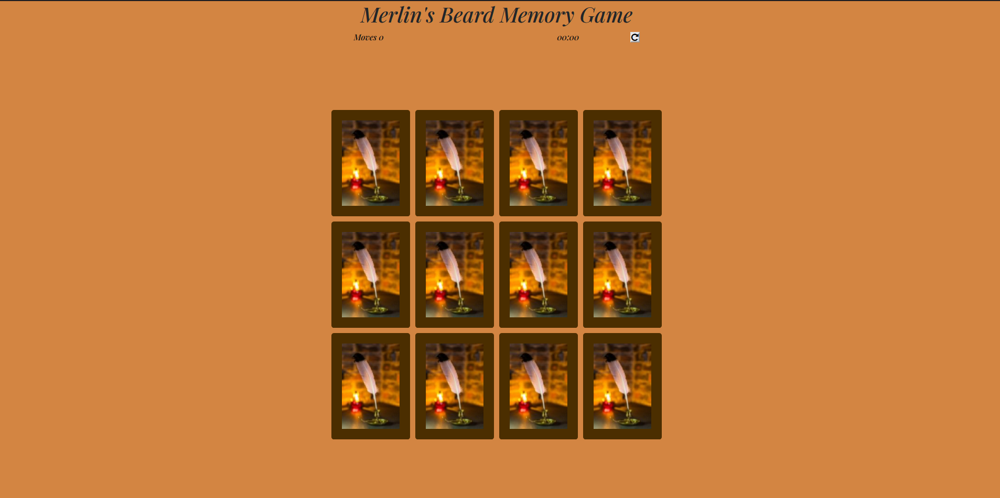

# __Merlin's Beard!__

## Code Institute Milestone Project 2

<a href = "https://lunarwriter.github.io/IFE-MS-2/" rel="nofollow"> View the live project here</a>

This is the website for Merlin's Beard! A fun interactive memory game for those who are fervent Harry Potter enthousiasts and are familiar with the wand movements.
Each time a player starts the game, the timer starts and their moves are counted. The player can restart the game to improve their scores! The memory game board will automatically shuffle cards for the players when a new game starts.

 

<h2 align="center">

</h2>

 

## User Experience (UX)

* ### User Stories

    * __Player Goals__

        1. As a Player, I want to be able to understand immediately what kind of game I will play.
        2. As a Player, I want to know how many moves and how long I played before finishing the game.
        3. As a Player, I want to be able to play the game again.

* ### Design

    * __Colour Scheme__

        * The main colours used are hues of brown, orange and beige.

    * __Typography__

        * The main font used for this game is Playfair Display. This font has a distinctive and somewhat aged air which is very suited for the theme of the game.

    * __Imagery__

        * The imagery is essential. The large hero image on the homepage is designed to appear both eye-catching, motivating and purposeful.

 

## Features

__Existing Features__

* __Navigation Bar__

    * Featured on all three pages, the full responsive navigation bar includes links to the Home page, Classes, Contact Log In page and is identical in each page to allow for easy navigation.
    * This section will allow the user to easily navigate from page to page.
    * The navigation bar will turn into a toggler when the device is the size of a tablet or smaller.
        This will make it easier for users to navigate through the page, as well as visually more attractive on smaller devices.

 

 __Possible Future Features__

* The website could be improved by adding a feature for a webshop for Dolly's Dojo products. 
By adding this feature, users can get appropriate and safe fitness gear to attend the gym, the group classes or gym at home if they wish.

* Another feature that could improve the website is adding online group classes.
By adding this feature, users can attend the gym from their own home and stay as fit as ever. The users could attend a virtual class with instructors giving live classes.

* A third feature for improvement is a login page for existing members to get access to their own account. 

 

## Wireframes

* [Home Page](https://github.com/lunarwriter/UCD-MS-1/blob/master/docs/wireframes/homepage-wireframe.PNG "homepage wireframe")
* [Classes Page](https://github.com/lunarwriter/UCD-MS-1/blob/master/docs/wireframes/classes-wireframe.PNG "classes wireframe")
* [Contact Us Page](https://github.com/lunarwriter/UCD-MS-1/blob/master/docs/wireframes/contact-page-wireframe.PNG "contact wireframe")
* [Mobile Wireframe](https://github.com/lunarwriter/UCD-MS-1/blob/master/docs/wireframes/mobile-wireframe.PNG "mobile wireframe")

 

##  Technologies Used

### Languages Used

* [HTML5](http://en.wikipedia.org/wiki/html5 "HTML5")
* [CSS3](http://en.wikipedia.org/wiki/css3 "CSS3")

 

### Frameworks, Libraries and Programs Used
1. [Bootstrap 4.3:](https://getbootstrap.com/docs/4.3/getting-started/introduction/ "Bootstrap4.3")
    * Bootstrap was used to assist with responsiveness and styling of the website.
2. [Google Fonts:](http://fonts.google.com/ "GoogleFonts")
    * Google Fonts were used to import the "Playfair Display" font into the style.css file. The font is used for all text in the game.
3. [Font Awesome:](http://fontawesome.com/ "Fontawesome")
    * Font Awesome was used to implement the repeat button on the top right corner for the game.
4. [jQuery:](http://jquery.com/ "jQuery")
    * jQuery came with Bootstrap to make sure the memory game was responsive to the moves counter and timer.
5. [Git:](http://git-scm.com/ "Git")
    * Git was used for version control by utilizing the Gitpod terminal to commit to Git and Push to GitHub.
6. [GitHub:](http://github.com/ "GitHub")
    * GitHub is used to store the projects code after being pushed from Git.
7. [Mockplus:](https://www.mockplus.com/ "Mockplus")
    * Mockplus was used to create the wireframes for the website.

 

## Known Bugs

* In the Contact form, when the user picks a country code for their mobile phone number, the country name does not reduce in size when viewed on mobile devices.
The validation check mark will appear right over the name of the country, making it slightly less legible.

 

## Fixed Bugs

* When the Contact Us button in the Contact form is submitted, the user would be directed to the Contact page once again. 
This is fixed and the user will now be directed to a page with a feedback message.
* The input field for the Mobile phone number in the Contact form had two separate fields, one for selecting country dialling code and one for entering the digits. 
This has been fixed and they are now merged into one field where the user can choose their country code and enter their phone digits.

 

## Deployment

__Running the website from GitPod__

1.	Log in to GitHub and locate the GitHub [Repository](https://github.com/lunarwriter/IFE-MS-2/ "github pages repository")
2.	On the right of the Repository name, click on the green “GitPod” button.
3.	Log in to GitPod and open the workspace with the same name as the repository.
4.	In the second column from the left, select the file to open the project.
5.	In the terminal (below the console), type: `python3 -m http.server`
6.	A popup will appear for action on port 8000. Click on the blue button for “Make Public”.
7.	Click on the second blue button “Open Browser” to open a preview of the website.

 

__GitHub Pages__

The project was deployed to GitHub Pages using the following steps...

1. Log in to GitHub and locate the GitHub [Repository](https://github.com/lunarwriter/IFE-MS-2/ "github pages repository")
2. At the top of the Repository (not top of page), locate the "Settings" Button on the menu. 
3. Scroll down the Settings page until you locate the "GitHub Pages" Section.
4. Under "Source", click the dropdown called "None" and select "Master Branch".
5. The page will automatically refresh.
6. Scroll back down through the page to locate the now published site [link](https://lunarwriter.github.io/IFE-MS-2 "live project") in the "GitHub Pages" section.

## Credits

__Code__

* Code structure taken from [this link](https://www.youtube.com/watch?v=ZniVgo8U7ek  "YouTube") for the basic structure of the memory game.

* Code structure for the timer and the move counter taken from [this link](https://stackoverflow.com/questions/69936780/how-to-stop-the-time-automatically-when-all-cards-are-flipped-in-memory-game-usi "StackOverflow")

* [Bootstrap 4.3:](https://getbootstrap.com/docs/4.3/getting-started/introduction/ "Bootstrap4.3") Bootstrap was used to make the site responsive using the Grid, Form, Navbar and Cards components, as well as making the button elements interactive.
* [GitHub](https://github.com/etjossem/country-codes-html/blob/master/_country_codes.html "Bootstrap4.3")
This page was used to create the dropdown menu for the country codes in the Contact Page form.
This way, users can select their countries and insert their respective phone numbers.

 

__Content__

* The text for the user reviews was taken from [Eatsleepwander](https://eatsleepwander.com/gym-review-example/ "user review text credits")
* The text and class names for the Classes page was taken from [Fitness365](https://fitness365.nl/locaties/amsterdam/groepslessen/ "classes page credits") translated from Dutch
* ReadMe structure and general content taken from [this sample](https://github.com/Code-Institute-Solutions/SampleREADME#user-experience-ux "readme1 credits") and [this sample](https://github.com/Code-Institute-Solutions/readme-template "readme2 credits")

 

__Media__

* The hero image and the user review images were taken from [Pexels](https://pexels.com/ "pexels credits")
* The images for the classes were taken from [Unsplash](https://unsplash.com/s/photos/ "unsplash credits")

 

* Backface image on the memory cards taken from [Pexels](https://www.pexels.com/photo/light-nature-bird-night-7978823/ "backface image credits")

* Front face images on the memory cards taken from [Pinterest](https://nl.pinterest.com/pin/824792119237101317/ "front face image credits")

* ReadMe structure and general content taken from [this sample](https://github.com/Code-Institute-Solutions/SampleREADME#user-experience-ux "readme1 credits") and [this sample](https://github.com/Code-Institute-Solutions/readme-template "readme2 credits")

